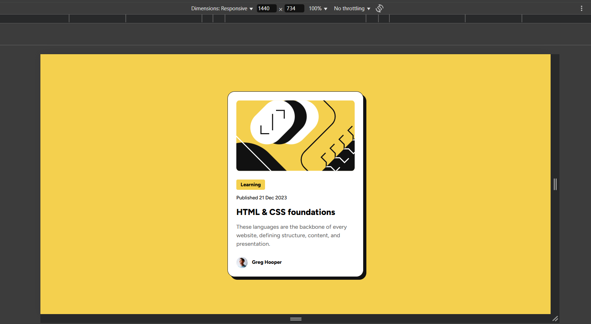
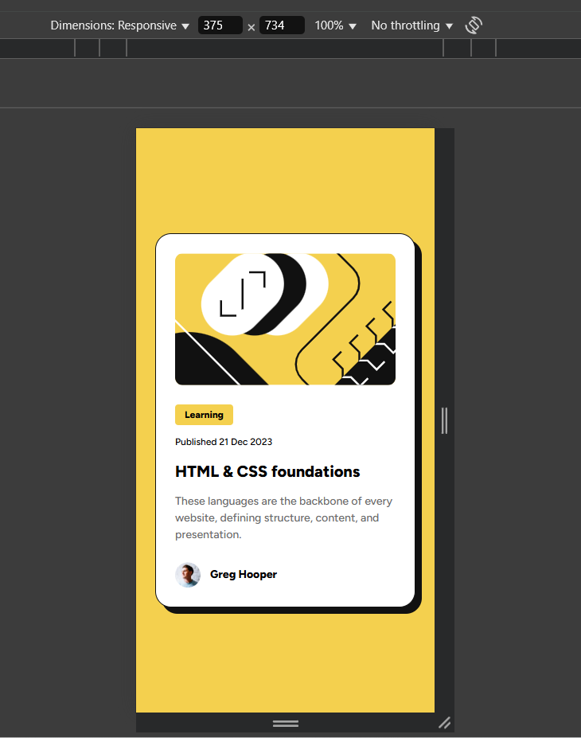

# Frontend Mentor - Blog preview card solution

This is a solution to the [Blog preview card challenge on Frontend Mentor](https://www.frontendmentor.io/challenges/blog-preview-card-ckPaj01IcS).

## Table of contents

- [Overview](#overview)
  - [The challenge](#the-challenge)
  - [Screenshot](#screenshot)
  - [Links](#links)
- [My process](#my-process)
  - [Built with](#built-with)
  - [What I used](#what-i-used)
- [Author](#author)

## Overview

### The challenge

Users should be able to:

- See hover and focus states for all interactive elements on the page

### Screenshot

Desktop (1440×734 px)



Mobile (375×734 px)



### Links

- Solution URL: [Add solution URL here](https://github.com/frontend-devv/blog-preview-card)
- Live Site URL: [Add live site URL here](https://your-live-site-url.com)

## My process

### Built with

- Semantic HTML5 markup
- CSS custom properties
- Flexbox
- [SCSS](https://sass-lang.com/) - For styles

### What I used

To create a responsive layout, I used:

- SCSS, including:
  - Nesting
  - Mixins
- Rem units instead of px for better scalability and consistency across devices
- Flexbox for centering elements
- The clamp() function. This approach eliminates the need for media queries by allowing the layout to adjust dynamically based on the viewport size.

Example of using mixins:

```scss
@mixin text-preset($size, $weight) {
  font-size: $size;
  font-weight: $weight;
  line-height: 1.5;
  letter-spacing: 0;
}

&__date {
  @include text-preset($text-size-small, $font-weight-regular);
}
```

## Author

- Frontend Mentor - [@frontend-dev](https://www.frontendmentor.io/profile/MarinaIvantsova)
